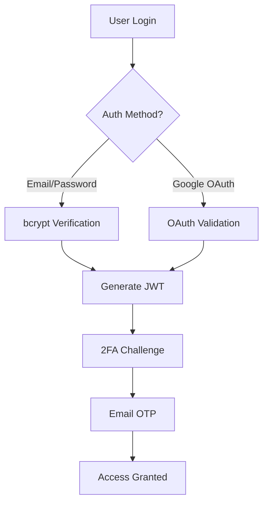

# 🌌 Nyxara
### *Your Digital Night Guardian*

<div align="center">


[](https://flutter.dev)
[](https://www.typescriptlang.org/)
[](https://python.org)
[](https://mongodb.com)

**Nyxara** is a comprehensive Flutter WebApp that serves as your digital security guardian, detecting data breaches using the XposedOrNot API and providing AI-powered security assistance. Named after **Nyx** (goddess of night) and **Ara** (defense/guard), Nyxara watches over your digital presence in the vast darkness of cyberspace.

[📖 Documentation](#features) | [🤝 Contributing](#-contributions) | [🛡️ Security](#-security-architecture)

</div>

---

## ✨ Features

### 🔍 **Breach Detection & Monitoring**
- **Real-time Breach Scanning** - Powered by XposedOrNot API
- **Email Compromise Detection** - Instant alerts for compromised accounts
- **Historical Breach Analysis** - Track your digital footprint over time
- **Smart Notifications** - Get notified of new breaches affecting your accounts

### 🤖 **AI-Powered Security Assistant**
- **Breach Advisor Agent** - Powered by Llama-3.3-70b-versatile via Groq API
- **Personalized Security Recommendations** - Tailored advice based on your risk profile
- **Threat Intelligence** - AI-driven insights on emerging security threats
- **Interactive Security Guidance** - Chat with your AI security consultant

### 🔐 **Advanced Vault Management**
- **Encrypted Password Storage** - Military-grade encryption for your credentials
- **Cross-Platform Synchronization** - Access your vault anywhere, anytime
- **Secure Sharing** - Share credentials safely with team members
- **Automatic Backup** - Never lose your important data

### 🔒 **Enterprise-Grade Security**
- **Two-Factor Authentication (2FA)** - Enhanced account protection
- **Google OAuth Integration** - Seamless and secure authentication
- **Email OTP Verification** - SMTP-based security verification
- **End-to-End Encryption** - Your data is always protected

### 📊 **Beautiful Data Visualization**
- **Interactive Charts** - Powered by Syncfusion Flutter Charts
- **3D Security Metrics** - Immersive data presentation with O3D
- **Real-time Dashboards** - Monitor your security posture at a glance
- **Custom Reports** - Generate detailed security analysis reports

---

## 🏗️ Architecture

### **Clean Architecture with BLoC Pattern**
```
🏛️ PRESENTATION LAYER (UI)
    ↓
🧠 BUSINESS LOGIC LAYER (BLoC)
    ↓
⚙️ USE CASES LAYER
    ↓
🗂️ DOMAIN REPOSITORY INTERFACE
    ↓
💾 DATA REPOSITORY IMPLEMENTATION
    ↓
🌐 DATA SOURCES (API/Database)
```

### **Multi-Tier Backend Architecture**
- **Authentication Service** - TypeScript + MongoDB (NoSQL)
- **Vault Management** - SQL with Cryptography
- **AI Advisory Service** - Python + Groq API
- **Email Service** - SMTP with App Passwords

---

## 🛠️ Tech Stack

### **Frontend**
- **Flutter Web** - Cross-platform web application
- **BLoC Pattern** - Predictable state management
- **Go Router** - Declarative routing solution
- **Syncfusion Charts** - Professional data visualization
- **O3D Engine** - 3D graphics and animations

### **Backend Services**
- **TypeScript + Node.js** - Authentication microservice
- **Python + FastAPI** - AI advisory service
- **MongoDB** - User authentication data
- **PostgreSQL** - Encrypted vault storage
- **Render** - Cloud deployment platform

### **Security & Encryption**
- **bcrypt** - Password hashing
- **Cryptography** - Data encryption
- **JWT Tokens** - Secure authentication
- **SMTP OTP** - Email verification

### **AI & Intelligence**
- **Groq API** - High-performance AI inference
- **Llama-3.3-70b** - Advanced language model
- **XposedOrNot API** - Breach detection service

---

## 🚀 Quick Start

### Prerequisites
- Flutter SDK (^3.7.2)
- Node.js (16+ recommended)
- Python (3.8+ recommended)
- MongoDB instance
- PostgreSQL database

### Installation

1. **Clone the Repository**
   ```bash
   git clone https://github.com/Aman071106/nyxara.git
   cd nyxara
   ```

2. **Setup Flutter App**
   ```bash
   flutter pub get
   cp assets/.env.example assets/.env
   # Configure your environment variables
   ```

3. **Setup Backend Services**
   ```bash
   # TypeScript Auth Service
   cd backend
   npm install
   npm run build
   
   # Python AI Service
   cd src/ai_agents
   pip install -r requirements.txt
   ```

4. **Configure Environment Variables**
   ```env
   # API Keys
   GROQ_API_KEY=your_groq_api_key
   
   # Database
   MONGODB_URI=your_mongodb_connection_string
   POSTGRES_URI=your_postgres_connection_string
   
   # Email Service
   EMAIL_USER=your_email@gmail.com
   EMAIL_APP_PASSWORD=your_app_password
   ```

5. **Launch the Application**
   ```bash
   flutter run -d chrome
   ```

---

## 🔒 Security Architecture

### **Data Protection**
- **AES-256 Encryption** - Industry-standard encryption for sensitive data
- **Salt & Hash** - bcrypt with custom salt for password security
- **Zero-Knowledge Architecture** - We never see your unencrypted data
- **Secure Transmission** - All data encrypted in transit with TLS 1.3

### **Authentication Flow**


### **Vault Security Model**
- **Client-Side Encryption** - Data encrypted before leaving your device
- **Key Derivation** - PBKDF2 with 100,000 iterations
- **Secure Storage** - Encrypted database with row-level security
- **Access Control** - Multi-factor authentication required

---

## 📱 Key Features Deep Dive

### **Breach Detection Engine**
Our advanced breach detection system continuously monitors multiple data sources:

- **Real-time API Integration** with  XposedOrNot
- **Historical Breach Database** with 10+ billion compromised accounts
- **Custom Alert System** with intelligent notification filtering
- **Breach Impact Assessment** with AI-powered risk analysis

### **AI Security Advisor**
Powered by cutting-edge AI technology:

- **Groq API Integration** for lightning-fast responses
- **Llama-3.3-70b Model** for sophisticated security analysis
- **Contextual Recommendations** based on your specific security profile
- **Proactive Threat Intelligence** to stay ahead of emerging risks

### **Vault Management System**
Enterprise-grade password management:

- **Zero-Knowledge Architecture** - We never see your passwords
- **Cross-Device Synchronization** with end-to-end encryption
- **Secure Password Generation** with customizable complexity
- **Breach-Aware Updates** - Automatic alerts for compromised passwords

---

## 🎨 User Interface

### **Modern Design Philosophy**
- **Dark Mode First** - Easy on the eyes during long security sessions
- **Responsive Design** - Seamless experience across all devices
- **Intuitive Navigation** - Clean, security-focused interface
- **Accessibility** - WCAG 2.1 AA compliant

### **3D Visualizations**
- **Interactive Security Metrics** - Engaging 3D charts and graphs
- **Threat Landscape Visualization** - See your security posture in 3D
- **Animated Breach Indicators** - Real-time visual alerts
- **Immersive Dashboard Experience** - Next-generation security UI

---

## 🔧 Development Setup


### **Development Guidelines**
- **Clean Architecture** - Separation of concerns with clear boundaries
- **BLoC Pattern** - Predictable state management across the app
- **Test-Driven Development** - Comprehensive unit and integration tests
- **Code Quality** - Lint rules and formatting standards enforced

---

## 🚀 Deployment

### **Flutter Web Deployment**
The application is optimized for web deployment with:
- **Progressive Web App (PWA)** capabilities
- **Service Worker** for offline functionality
- **Optimized Bundle Size** with tree-shaking
- **CDN Integration** for global performance

### **Backend Deployment on Render**
```yaml
# render.yaml
services:
  - type: web
    name: nyxara-backend
    env: node
    plan: free
    buildCommand: npm run build
    startCommand: npm start
    rootDir: backend
```

### **Environment-Specific Configurations**
- **Development** - Local databases and API keys
- **Staging** - Testing environment with sanitized data
- **Production** - Fully encrypted with monitoring and alerts

---

## 🧪 Testing Strategy

### **Comprehensive Test Coverage**
- **Unit Tests** - Individual component and function testing
- **Integration Tests** - Feature interaction testing
- **Widget Tests** - UI component behavior verification
- **End-to-End Tests** - Complete user journey validation

### **Security Testing**
- **Penetration Testing** - Regular security audits
- **Vulnerability Scanning** - Automated security assessments
- **Compliance Verification** - GDPR and security standard adherence

---

## 🌟 Roadmap

### **Phase 1: Core Security** ✅
- [x] Basic breach detection
- [x] Secure authentication
- [x] Password vault
- [x] AI security advisor

### **Phase 2: Advanced Features** 🚧
- [ ] Real-time breach monitoring
- [ ] Team collaboration features
- [ ] Advanced threat intelligence
- [ ] Mobile app versions

### **Phase 3: Enterprise** 📋
- [ ] Enterprise SSO integration
- [ ] Advanced compliance reporting
- [ ] API for third-party integrations
- [ ] Custom security policies

### **Phase 4: AI Evolution** 🤖
- [ ] Predictive breach analysis
- [ ] Automated security responses
- [ ] Custom AI model training
- [ ] Advanced behavioral analytics

---

## 🤝 Contributing

We welcome contributions from security enthusiasts and developers! Here's how you can help:

### **Ways to Contribute**
- 🐛 **Bug Reports** - Help us identify and fix issues
- ✨ **Feature Requests** - Suggest new security features
- 🔧 **Code Contributions** - Submit pull requests
- 📚 **Documentation** - Improve our guides and tutorials
- 🧪 **Testing** - Help us maintain quality standards

### **Contribution Guidelines**
1. **Fork the Repository** and create your feature branch
2. **Follow Coding Standards** - Use our linting and formatting rules
3. **Write Tests** - Ensure your code is well-tested
4. **Update Documentation** - Keep README and docs current
5. **Submit Pull Request** - Provide clear description of changes

### **Development Environment**
```bash
# Setup development environment
git clone https://github.com/Aman071106/nyxara.git
cd nyxara
flutter pub get
flutter test  # Run tests
flutter analyze  # Check code quality
```

---

## 📄 License

**MIT License** - We believe in open-source security tools.

```
MIT License

Copyright (c) 2024 Nyxara

Permission is hereby granted, free of charge, to any person obtaining a copy
of this software and associated documentation files (the "Software"), to deal
in the Software without restriction, including without limitation the rights
to use, copy, modify, merge, publish, distribute, sublicense, and/or sell
copies of the Software, and to permit persons to whom the Software is
furnished to do so, subject to the following conditions:

The above copyright notice and this permission notice shall be included in all
copies or substantial portions of the Software.

THE SOFTWARE IS PROVIDED "AS IS", WITHOUT WARRANTY OF ANY KIND, EXPRESS OR
IMPLIED, INCLUDING BUT NOT LIMITED TO THE WARRANTIES OF MERCHANTABILITY,
FITNESS FOR A PARTICULAR PURPOSE AND NONINFRINGEMENT.
```


---

## 🙏 Acknowledgments

Special thanks to:
- **XposedOrNot** - For providing the breach detection API
- **Groq** - For high-performance AI inference
- **Flutter Team** - For the amazing cross-platform framework
- **Security Community** - For continuous feedback and contributions
- **Open Source Contributors** - Making digital security accessible to all

---

<div align="center">

**Made with 💙 by developers who care about your digital security**

*Nyxara - Because your digital safety should never sleep*

[](https://github.com/Aman071106/nyxara)

---

*"In the darkness of cyberspace, Nyxara stands guard"* 🌙🛡️

</div>